# React BattleShip

this is a fully responsive **BattleShip** game made in **react/redux** and other tools , the game is 5 pages and has 3 reducers to mange actions & state ,it optimizes DRY concept and other react best practices , the rules of the game is explained in it ,you can start playing it [here][live] ,the game routes is protected by the name , it won't work unless you provide your name ,and you can choose to make the game remember that so you don't need to enter it again, and there's a dashboard for all the results where you can see all the other games result and other information.

<br>
<hr>

## run it locally !

#### install dependencies

> npm install

#### Run in dev mode

> npm start

<hr>

## tools used in this app

- react
- redux / react-redux
- framer motion
- tailwindCss
- react-icons
- toastify
- rect router
- react-icons
  <hr>

## _File structure_

```bash
.
├── public
│  
└── src
    ├── assets (all assists used)
    │   └── readme-images
    │
    ├── components (all project Components)
    │
    ├── helpers (helper functions)
    │
    ├── pages (routes Components)
    │
    └── store (redux Store/Reducers/Actions)
        ├── cells
        │   └── botCells
        └── main

```

## images from the game

<div style='display:flex; flex-directions:column;gap:2px;'>
   
   <div style="height: auto; width: 100vw"></div>
    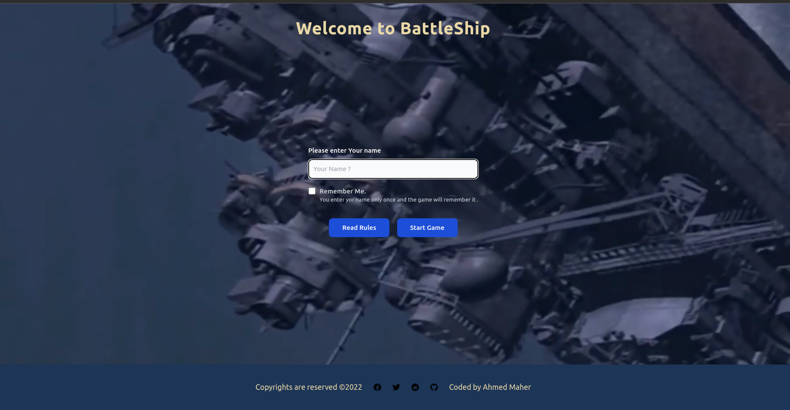
      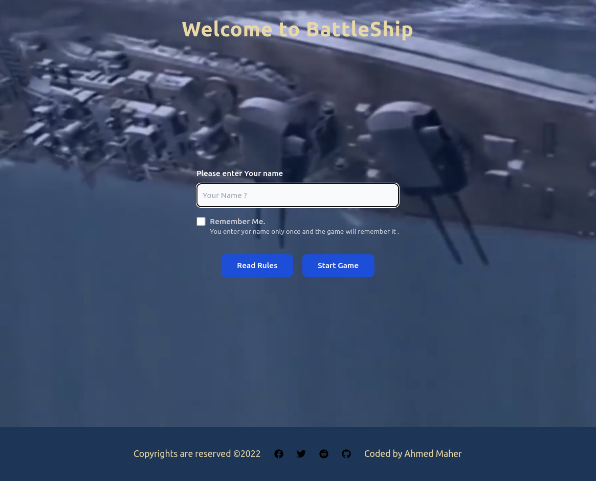
      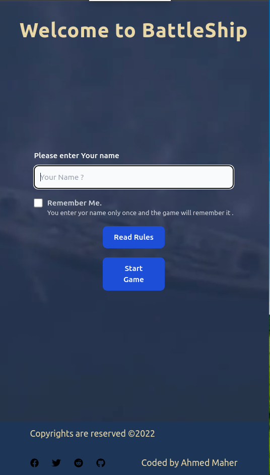

  </div>
   <div style="height: auto; width: 100vw"></div>
      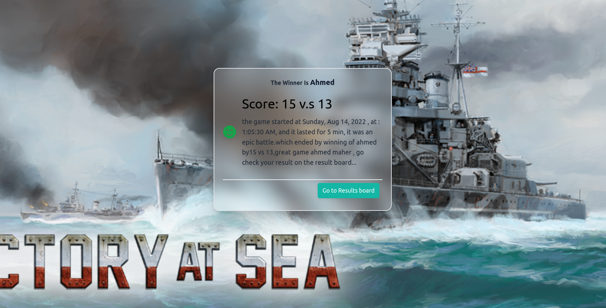
      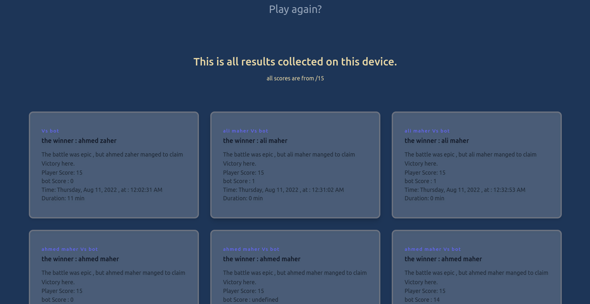

</div>
 <div style="height: auto; width: 100vw"></div>
      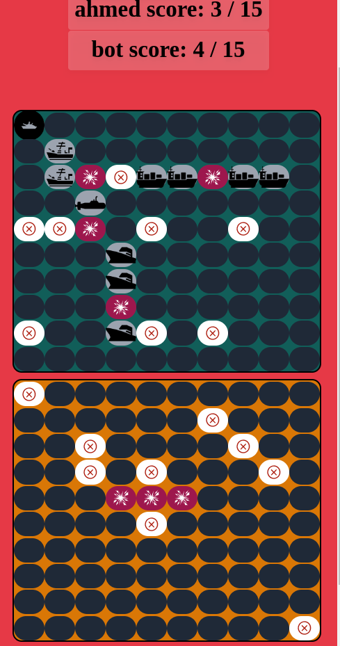
      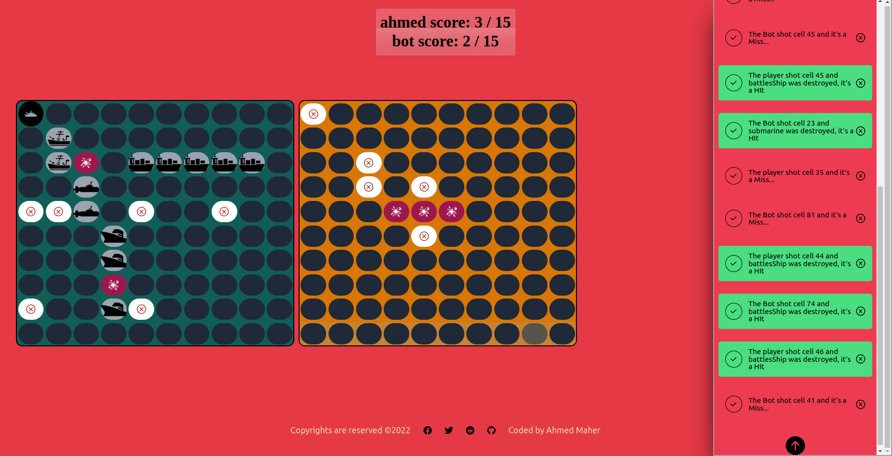
      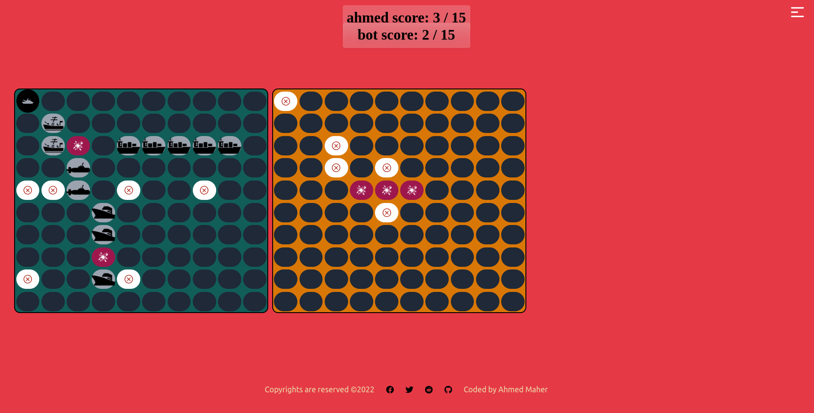
</div>
 <div style="height: auto; width: 100vw"></div>
      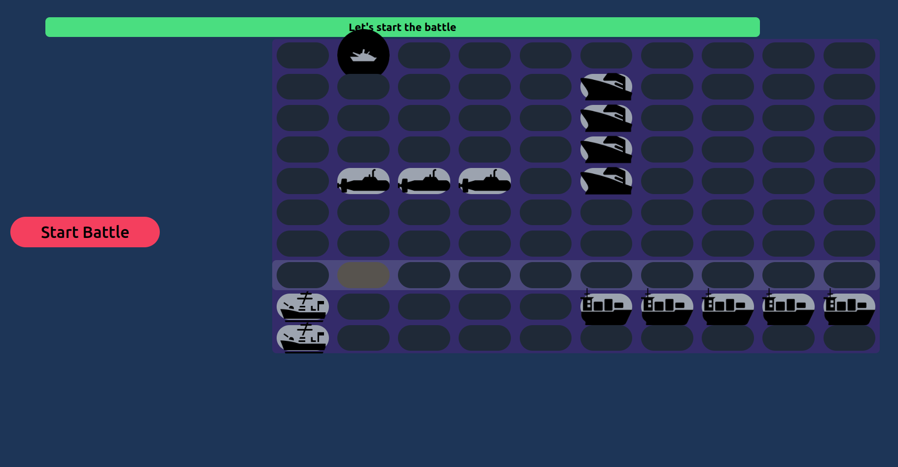
      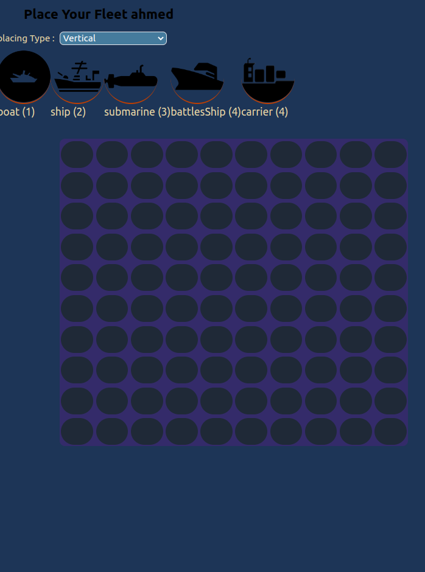
      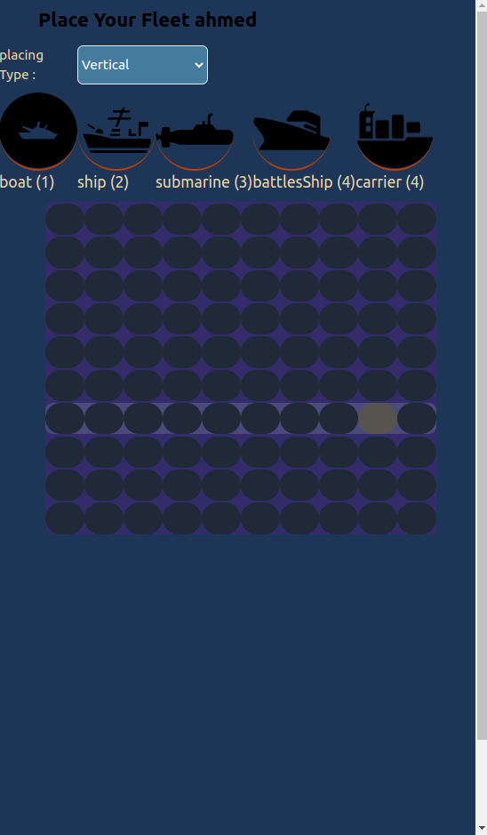
      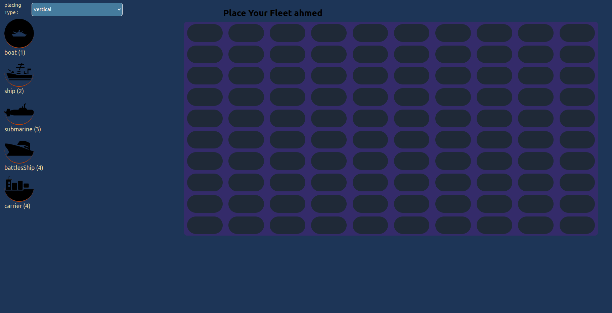
</div>
 <div style="height: auto; width: 100vw"></div>
      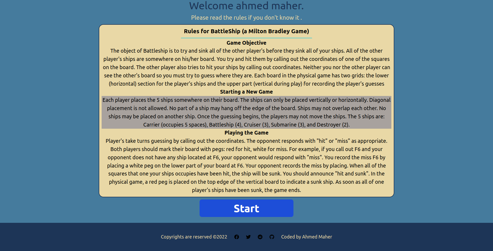
      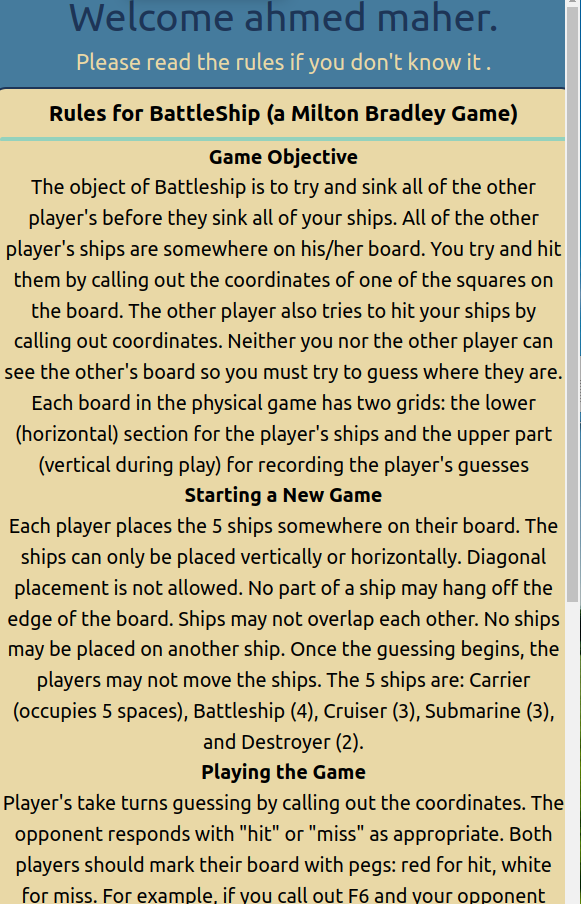
      
</div>

</div>

- What was your motivation?
- Why did you build this project?
- What problem does it solve?
- What did you learn?
- design design and why you made them
- What makes your project stand out?
- If your project has a lot of features, consider adding a "Features" section and listing them here.

## What to include im my readme

1. Project's Title / open in vs code
2. Project Description
3. Table of Contents (Optional)/file structure
4. How to Install and Run the Project
5. How to Use the Project
6. Include Credits
7. Add a License
8. Badges
9. How to Contribute to the Project
10. Include Tests

[repo]: https://github.com/ahmedmaher2481998/react-battleships
[live]: https://battleship-react-amaher938.netlify.app/
